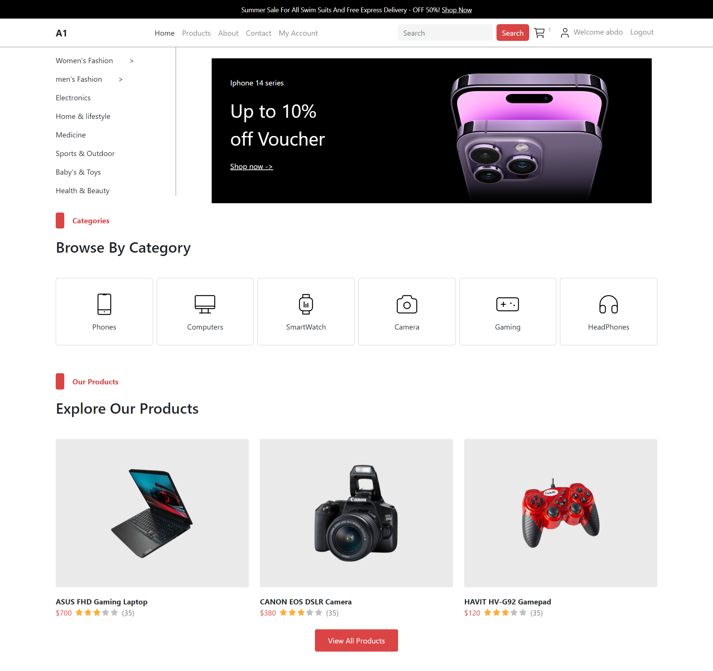
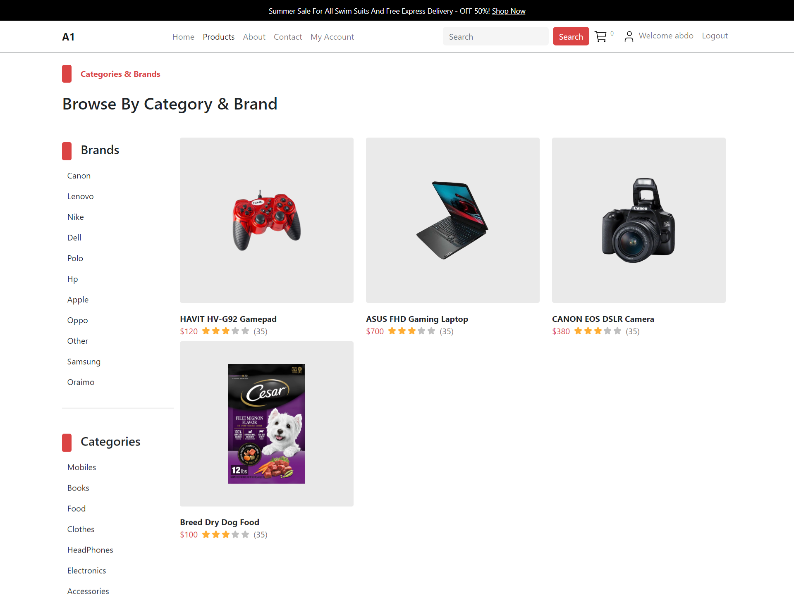
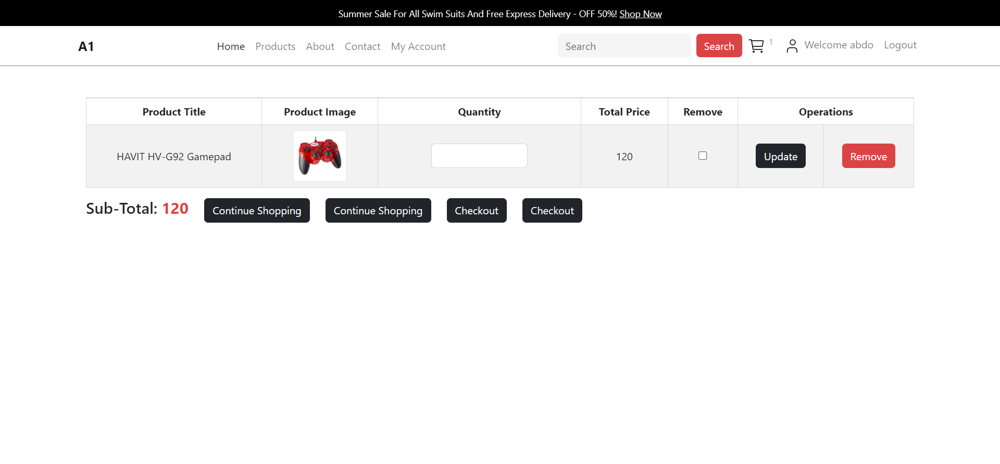
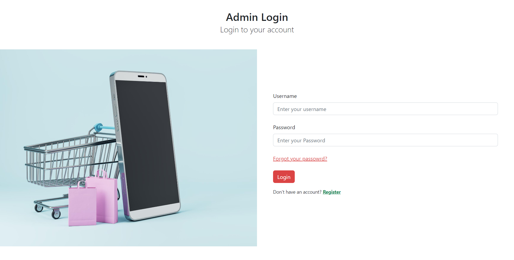
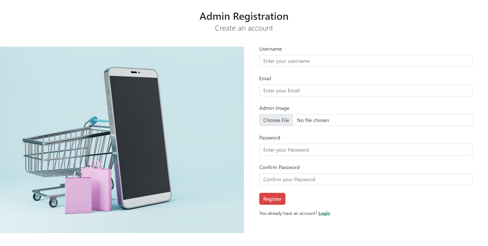
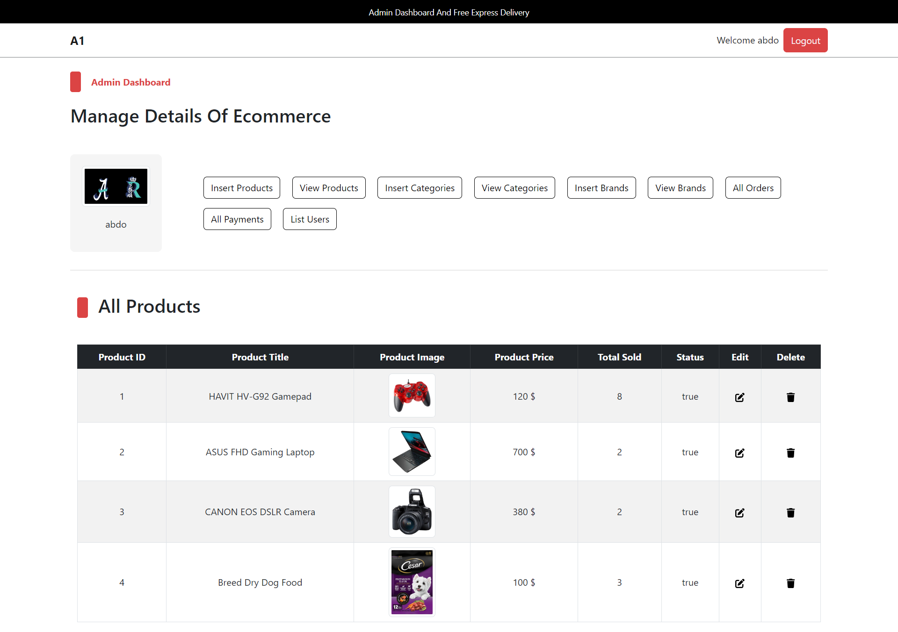

# 🛒 Scalable and Secure E-commerce Platform on AWS

This project demonstrates the design, deployment, and monitoring of a **scalable and secure e-commerce platform** hosted entirely on AWS. It was developed as part of the ENPM818N Mid-Term Project by Group Members at the University of Maryland.

---

## 👥 Team Members

- Bhanu Teja Panguluri  
- Bharat Gurbaxni  
- Yijie Bao  
- Palak Gupta  

---

## 📌 Objectives

- Deploy a highly available e-commerce application on AWS.
- Implement **Auto Scaling** and **Application Load Balancing** for dynamic traffic handling.
- Secure the platform using **AWS WAF**, **TLS**, **IAM roles**, and **encryption at rest & in transit**.
- Integrate **CloudFront CDN** to accelerate global content delivery.
- Monitor infrastructure with **AWS CloudWatch, CloudTrail, and AWS Config**.
- Provide cost analysis and future scalability recommendations.

---

## 🧱 Architecture Overview

The solution is built on a robust AWS architecture including:

- **Custom VPC** with public/private subnets across multiple AZs
- **EC2 Auto Scaling Group** with an **Application Load Balancer**
- **Multi-AZ Amazon RDS** for backend database
- **CloudFront** for static landing page delivery
- **Route 53** for DNS management and HTTPS support
- **AWS WAF**, **IAM**, **SSL/TLS**, and **KMS** for security

---

## ⚙️ Implementation Details

### 🔧 Infrastructure

- VPC with CIDR `/16` and segmented subnets `/24`
- Auto Scaling via Launch Template + CloudWatch alarms
- ALB with health checks and listener rules for HTTP/HTTPS
- Security Groups configured for HTTP, HTTPS, and SSH access

### 🛢️ Database

- Amazon RDS (MySQL) with **Multi-AZ** deployment
- Data encryption via **KMS** and **SSL/TLS**
- IAM-based access controls and automated backups with point-in-time recovery

### 🛡️ Security Features

- **AWS WAF** with managed & custom rules against XSS, SQLi, DoS
- TLS-enabled communication (HTTPS enforced at ALB and CloudFront)
- **IAM roles** and **Least Privilege Access**
- **CloudTrail** and **AWS Config** for compliance & visibility

### 🌍 Content Delivery

- Static landing page via CloudFront: [`https://bestoffers.icu`](https://bestoffers.icu)
- Redirects to main site: [`https://www.enpm818n.xyz`](https://www.enpm818n.xyz)
- HTTPS enabled with AWS Certificate Manager

---

## 🧪 Testing & Monitoring

### 📊 Stress Testing Scenarios

- Simulated up to **250 concurrent users** using **AWS Distributed Load Testing**
- Evaluated success rate under various task configurations
- Confirmed effective autoscaling and database load distribution

### 🖥️ Monitoring Setup

- **AWS CloudWatch Dashboards** for:
  - EC2 Auto Scaling Group
  - Application Load Balancer
  - RDS Performance
  - CDN Hit/Miss and error rates
- Alarms for high/low CPU usage and request spikes
- **CloudTrail** and **AWS Config** used for auditing and compliance checks

---

## 💰 Cost Breakdown

| Service           | Monthly Estimate |
|------------------|------------------|
| EC2 Instances     | $500             |
| RDS (Multi-AZ)    | $300             |
| CloudFront CDN    | $150             |
| Additional Services (WAF, S3, Route 53, etc.) | $50 |
| **Total**         | **$1,000**       |

📉 Cost Optimization Strategies:
- Reserved Instances & Savings Plans
- Spot Instances for dev tasks
- Cache tuning & right-sizing resources

---

## 🔮 Future Improvements

- Implement **AWS Shield** for advanced DDoS protection
- Add **Secrets Manager** for managing credentials securely
- Introduce **Auto Scaling for RDS**
- Use **ElastiCache** to offload read-heavy database queries
- Configure **cross-region replication** for disaster recovery
- Deploy **CI/CD pipelines** with CodePipeline + CodeDeploy

---

## 🌐 Live Demo Links

- **Landing Page**: [https://bestoffers.icu](https://bestoffers.icu)
- **Main E-Commerce Site**: [https://www.enpm818n.xyz](https://www.enpm818n.xyz)

---

## 📝 License

This project is for academic purposes and educational use only. Contact authors for permission before reuse or adaptation.

---

